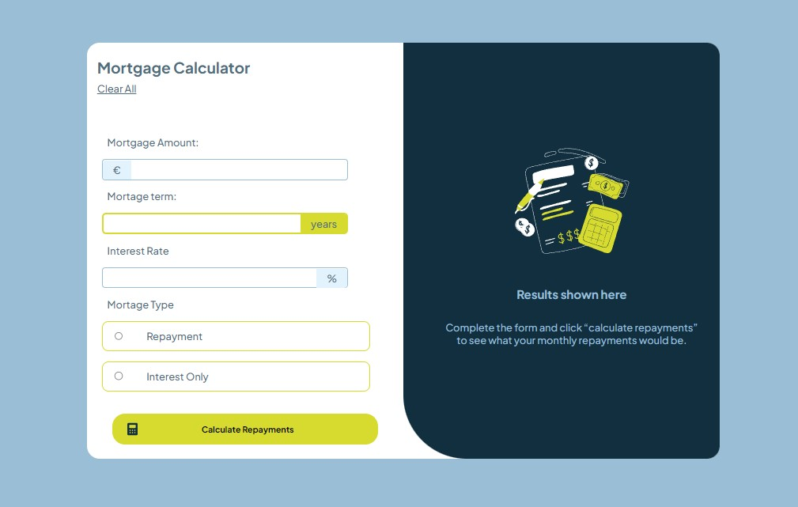

# Frontend Mentor - Mortgage repayment calculator solution

This is a solution to the [Mortgage repayment calculator challenge on Frontend Mentor](https://www.frontendmentor.io/challenges/mortgage-repayment-calculator-Galx1LXK73). Frontend Mentor challenges help you improve your coding skills by building realistic projects.

## Table of contents

- [Overview](#overview)
  - [Screenshot](#screenshot)
  - [Links](#links)
- [My process](#my-process)
  - [Built with](#built-with)
  - [What I learned](#what-i-learned)
- [Author](#author)

## Overview

### Screenshot



### Links

- Solution URL: [My solution](https://github.com/Jani-B/mortage_calculator)
- Live Site URL: [My Live site](https://jani-b.github.io/mortage_calculator)

## My process

### Built with

- Semantic HTML5 markup
- CSS custom properties
- Flexbox
- CSS Grid
- Mobile-first workflow
- Javascript

### What I learned

```css (basically because could not find any other approach for this)
.form-mortage__span-input-interest:focus-within::before {
  background-color: var(--Lime);
}
```

## Author

- Frontend Mentor - [@Jani-B](https://www.frontendmentor.io/profile/Jani-B)
